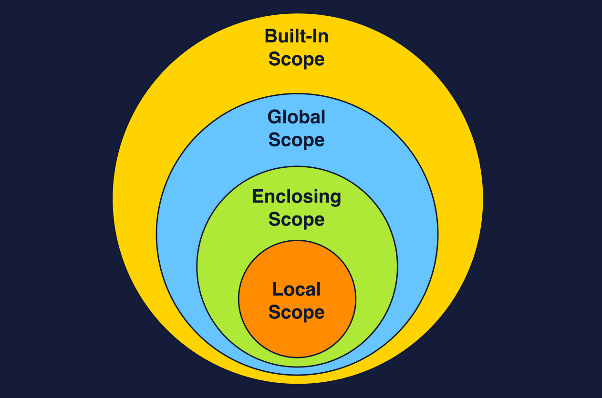

# Scopes in Python

## Table of Content

| Sr. No. | Name                                                               |
| ------- | ------------------------------------------------------------------ |
| 1.      | [What is a Scope? What are it's types?](#scope-and-types-of-scope) |
| 2.      | [Local Scope](#local-scope)                                        |
| 3.      | [Enclosing Scope](#enclosing-scope)                                |
| 4.      | [Global Scope](#global-scope)                                      |
| 5.      | [Scope Resolution](#scope-resolution)                              |

## Scope and Types of Scope

Scopes define which namespaces our program will be able to look into at a particular line of code and in what order.

Similarly to namespace, there are 4 different level of scopes. These scopes are:

1. Built-in scope
2. Global scope
3. Enclosing scope
4. Local scope



## Local Scope

Local scope is the deepest scope of all the scopes. Whenever a function is called, a new local scope is generated for the execution of that function. Each subsequent call of that function will generate a new local scope each time it is called.

Names or Identifiers in the local scope can't be accessed or modified by any outer scope.

As a rule of thumb, any names created in our local namespace are also locally scoped.

Eg:

```py
name = 'Goku' # globally scoped

def print_name():
  name = 'Kakarot'
  print(name)

print(name) # prints Goku
print_name() # prints Kakarot
```

## Enclosing Scope

Enclosing or Non-local scope allows any value defined in an enclosing function to be accessed in any functions below it.

There are two things to keep in mind here:

1. Scope is only accessible upwards and outwards. That means the deepest level has the access to the entire series of scopes but not the other way around.

2. Variables which are immutable objects such as string or numbers, can be accessed from an inner scope but can't be modified.

```py

def enclosing_function():
  enclosed_var = 'Some value'


  def inner_function():
    print(enclosed_var)
    # enclosed_var += 'nice' # throws an error

  inner_function()

enclosing_function()
```

### Modifying scope behavior; Changing Enclosed Variables

As visible above, modifying a enclosed variable throws an error.

Python does however provides a way for us to modify names in the enclosing scope, by using the `nonlocal` statement.

```py

def enclosing_function():
  enclosed_var = 'Some value'


  def inner_function():
    nonlocal enclosed_var
    print(enclosed_var)
    enclosed_var += 'nice' # works fine now

  inner_function()

enclosing_function()
```

## Global Scope

Names defined in global namespace would be automatically global scoped and thus, can be accessed anywhere in the program.

```py

# global scope variable
gravity = 9.8

def get_force(mass):
  gravity += 100 # throws an error
  # only enclosed variable can be modified using the nonlocal keyword
  return mass * gravity

print(get_force(60))
```

However, we can use the `global` keyword.

### Modifying Scope Behavior; Changing Global Variables

Sometimes, we want to modify global names from a local scope. However, although, global names can be used in the local scope, they can't be modified.

```py
var = 10

def changer():
  var = 20

changer()
print(var) # prints 10
```

Similar to the nonlocal statement, Python provides the `global` statement to modify the global names from a local scope.

```py
var = 10

def changer():
  global var
  var = 20

print(var) # prints 20
```

In addition, `global` statement can be used even if the name is not defined in the global scope. Using the `global` statement would create a new global variable in the global scope.

## Scope Resolution

Scope resolution is a term used to describe a search procedure for a name (in various namespaces), through a set of rules that dictate the order that the search needs to follow.

In Python, the unofficial rule (often referred to in literature but does not exist in the official documentation) is known as the LEGB rule.

LEGB stands for Local, Enclosing, Global, and Built-in. These four letters represent the order of namespaces Python will check to see if a name exists.
